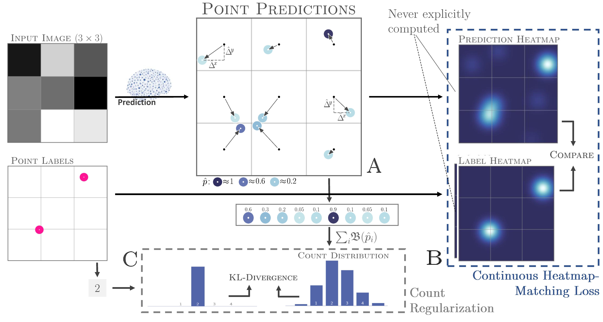
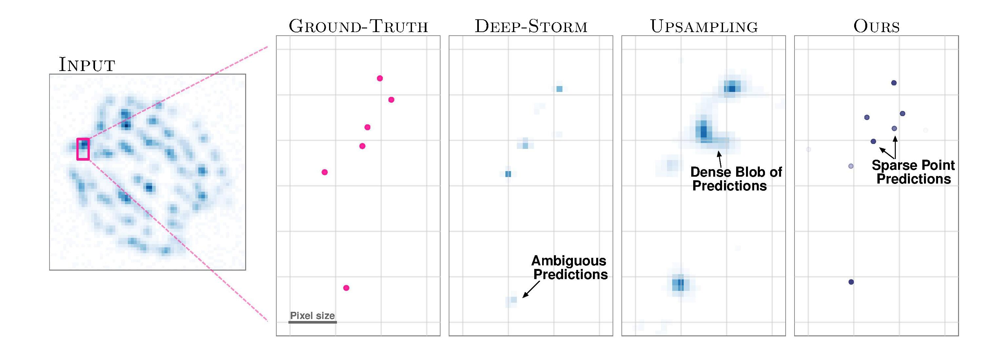
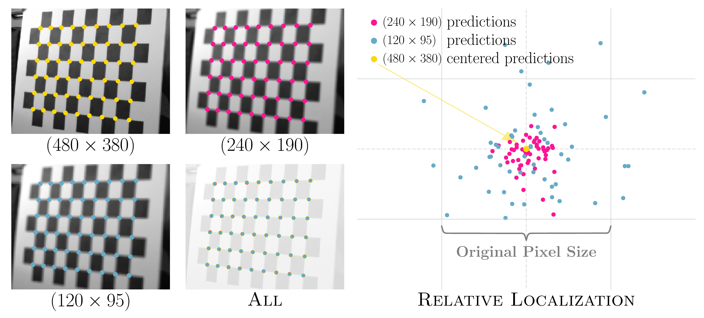
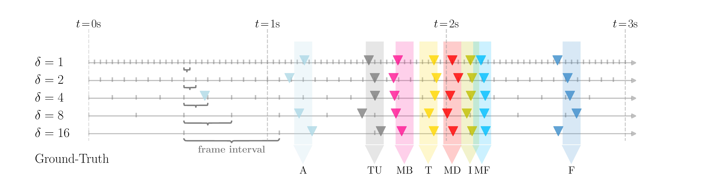

# Learning Multi-Instance Sub-pixel Point Localization
Under Review

<div style="text-align: justify">
In this work, we propose a novel approach that allows for the end-to-end learning of multi-instance point detection with inherent sub-pixel precision capabilities. To infer unambiguous localization estimates, our model relies on three components: the continuous prediction capabilities of offset-regression-based models, the finer-grained spatial learning ability of a novel continuous heatmap matching loss function introduced to that effect, and the prediction sparsity ability of count-based regularization. We demonstrate state-of-the-art sub-pixel localization accuracy on molecule localization microscopy and checkerboard detection, and improved sub-frame event detection performance in sport videos.
</div>

#### Both PyTorch and Tensorflow implementations of our loss function are available.




---
### (Section 3.3) Detection Sparsity (Appendix Videos generation) [Tensorflow (1.13)]

To produce the convergence videos (NoRegularizer.mp4 and WithRegularizer.mp4) simply set both: whether you want to use counting regularization (in line 7 in main.py) and the name of your video (in line 7 in main.py and line 4 in saveVideo.py). Then run,

```
python main.py
python saveVideo.py
```

---
### (Section 4.1) Single Molecule Localization Microscopy [PyTorch (1.3)]


&nbsp;&nbsp;&nbsp;&nbsp;&nbsp;&nbsp;&nbsp;&nbsp;&nbsp;&nbsp;&nbsp;&nbsp;[[Deep-Storm Benchmark & Training Data]](https://github.com/EliasNehme/Deep-STORM/tree/master/demo%201%20-%20Simulated%20Microtubules) by Nehme et al. (see demo 1 for data)

&nbsp;&nbsp;&nbsp;&nbsp;&nbsp;&nbsp;&nbsp;&nbsp;&nbsp;&nbsp;&nbsp;&nbsp;[[Ground-Truth Positions]](http://bigwww.epfl.ch/smlm/challenge/index.html) from Sage et al. (also included in our repo data/GT.csv)

&nbsp;&nbsp;&nbsp;&nbsp;&nbsp;&nbsp;&nbsp;&nbsp;&nbsp;&nbsp;&nbsp;&nbsp;[[Assessement Tool]](http://bigwww.epfl.ch/smlm/challenge/index.html?p=assessment-tools) by Sage et al.

Create dataset as in  Nehme et al.
```
create_dataset.py
```

To train our model:
```
python pytoch_Main.py
```
Before running the script, copy all the benchmark data provided by [Nehme et al.](https://github.com/EliasNehme/Deep-STORM/tree/master/demo%201%20-%20Simulated%20Microtubules) (demo 1) in a directory "benchmark data".

To obtain the final metrics, use the tool provided by [Sage et al.](http://bigwww.epfl.ch/smlm/challenge/index.html?p=assessment-tools) (CompareLocalization.jar), the grond-truth position are given in data/GT.csv.



---
### (Section 4.2) Checkerboard Corner Detection [PyTorch (1.3)]


&nbsp;&nbsp;&nbsp;&nbsp;&nbsp;&nbsp;&nbsp;&nbsp;&nbsp;&nbsp;&nbsp;&nbsp;[[Test Dataset Request]](https://link.springer.com/chapter/10.1007/978-3-319-10593-2_50) The dataset has to be requested from the authors of _ROCHADE: Robust Checkerboard Advanced Detection for Camera Calibration_.

&nbsp;&nbsp;&nbsp;&nbsp;&nbsp;&nbsp;&nbsp;&nbsp;&nbsp;&nbsp;&nbsp;&nbsp;[[ROCHADE Benchmarks]](https://link.springer.com/chapter/10.1007/978-3-319-10593-2_50) upon request to the authors, [[OCamCalib Benchmarks]](https://sites.google.com/site/scarabotix/ocamcalib-toolbox), [[OpenCV Benchmarks]](https://opencv.org/)

&nbsp;&nbsp;&nbsp;&nbsp;&nbsp;&nbsp;&nbsp;&nbsp;&nbsp;&nbsp;&nbsp;&nbsp;[[Training dataset]]() The training dataset can be provided upon request.


For all dataset related functionalities:
```
create_dataset.py, create_downsampled_set.py
```

To train our model:
```
python pytoch_main_ours.py
```

To train the other deep learning benchmark:
```
python pytoch_main_HM_benchmark.py
```

All the evaluations can be done using:
```
pytoch_eval_synthetic.py, pytoch_eval_uEye.py, pytoch_eval_GoPro.py, pytoch_eval_reprojection_uEye.py, pytoch_eval_reprojection_GoPro.py.
```





---
### (Section 4.3) Sub-frame Temporal Event Detection [PyTorch (1.3)]
&nbsp;&nbsp;&nbsp;&nbsp;&nbsp;&nbsp;&nbsp;&nbsp;&nbsp;&nbsp;&nbsp;&nbsp;[[Benchmark Code and Dataset]](https://github.com/wmcnally/golfdb) by McNally et al.

To run our model on for all downsampling rate and splits:

```
bash multi_run_steps.sh
```

To run the dense classification benchmark:

```
bash dense_original_run_steps.sh
```

By settings the flag on line 27 in upsampling_original_train.py and on line 32 in upsampling_original_eval.py, one can run the naive upsample benchmark (False) or the frame interpolation benchmark (True) with the following command:

```
bash upsampling_original_run_steps.sh
```
Note that for the frame upsampling benchmark, the videos need first to be downsampled and then upsampled using the frame interpolation model from Bao et al.. To do so, use "Golf_upsample_video.py" in conjunction with their official implementation [[git]](https://github.com/baowenbo/DAIN).


